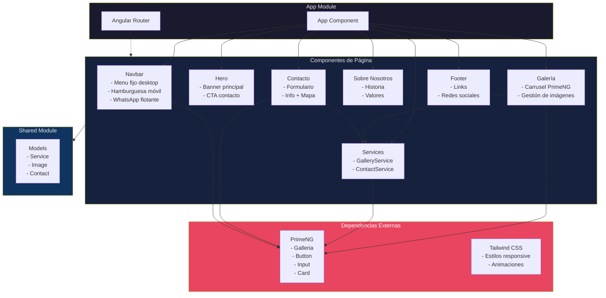

# Plan de Proyecto - Ironman Taller de Soldadura

## Resumen del Proyecto

Página web responsiva para "Ironman", un taller de soldadura especializado en:

- Puertas y ventanas metálicas con cristal
- Cercas metálicas
- Trabajos de soldadura sobre vehículos (bicitaxis, motorinas)

## Paleta de Colores Metálica

| Color             | Hex       | Uso                           |
| ----------------- | --------- | ----------------------------- |
| Acero Oscuro      | `#1a1a2e` | Fondos principales            |
| Grafito           | `#16213e` | Secciones alternas            |
| Acero Medio       | `#0f3460` | Acentos                       |
| Naranja Soldadura | `#e94560` | Botones, llamadas a la acción |
| Plata Metal       | `#e8e8e8` | Textos principales            |
| Oro Metal         | `#ffd700` | Detalles premium              |
| Cobre             | `#b87333` | Acentos secundarios           |

## Estructura del Proyecto Angular

```
ironman-welding/
├── src/
│   ├── app/
│   │   ├── components/
│   │   │   ├── navbar/
│   │   │   ├── hero/
│   │   │   ├── services/
│   │   │   ├── gallery/
│   │   │   ├── about/
│   │   │   ├── contact/
│   │   │   └── footer/
│   │   ├── shared/
│   │   │   ├── models/
│   │   │   └── services/
│   │   ├── app.component.ts
│   │   ├── app.config.ts
│   │   └── app.routes.ts
│   ├── assets/
│   │   ├── images/
│   │   └── data/
│   └── styles.scss
├── tailwind.config.js
└── package.json
```

## Componentes y Funcionalidades

### 1. Navbar (Menú de Navegación)

- **Desktop**: Menú fijo horizontal con enlaces: Inicio, Servicios, Galería, Sobre Nosotros, Contacto
- **Móvil**: Menú hamburguesa desplegable con animación suave
- **Logo**: "Ironman" con icono de soldadura
- **Botón WhatsApp**: Acceso rápido flotante

### 2. Hero (Inicio)

- Imagen de fondo con overlay metálico
- Título: "Ironman - Taller de Soldadura"
- Subtítulo descriptivo
- Botón CTA: "Contáctanos"
- Efectos de chispas de soldadura (animación CSS)

### 3. Servicios

Cards con los servicios:

- Puertas Metálicas
- Ventanas con Cristal
- Cercas y Rejas
- Soldadura de Vehículos (bicitaxis, motorinas)
- Reparaciones Generales

### 4. Galería (Carrusel)

- Carrusel de imágenes usando PrimeNG Galleria
- Soporte para añadir/quitar imágenes dinámicamente
- Vista en lightbox
- Navegación con thumbnails

### 5. Sobre Nosotros

- Historia del taller
- Misión y Visión
- Valores (calidad, experiencia, garantía)
- Imagen del equipo/taller

### 6. Contacto

- Formulario funcional con:
  - Nombre
  - Email
  - Teléfono
  - Mensaje
- Información de contacto:
  - Teléfono
  - Email
  - Dirección
  - Horarios
- Mapa embebido (opcional)
- Botón flotante de WhatsApp

### 7. Footer

- Logo y descripción breve
- Enlaces rápidos
- Redes sociales
- Copyright

## Dependencias Necesarias

```json
{
  "dependencies": {
    "@angular/animations": "^21.1.4",
    "@angular/common": "^21.1.4",
    "@angular/compiler": "^21.1.4",
    "@angular/core": "^21.1.4",
    "@angular/forms": "^21.1.4",
    "@angular/platform-browser": "^21.1.4",
    "@angular/platform-browser-dynamic": "^21.1.4",
    "@angular/router": "^21.1.4",
    "primeng": "^21.1.1",
    "primeicons": "^7.0.0",
    "rxjs": "~7.8.2",
    "tslib": "^2.8.1",
    "zone.js": "~0.16.0"
  },
  "devDependencies": {
    "@angular-devkit/build-angular": "^21.1.4",
    "@angular/cli": "^21.1.4",
    "@angular/compiler-cli": "^21.1.4",
    "@types/jasmine": "~6.0.0",
    "autoprefixer": "^10.4.24",
    "jasmine-core": "~6.0.1",
    "karma": "~6.4.4",
    "karma-chrome-launcher": "~3.2.0",
    "karma-coverage": "~2.2.1",
    "karma-jasmine": "~5.1.0",
    "karma-jasmine-html-reporter": "~2.2.0",
    "postcss": "^8.5.6",
    "tailwindcss": "^4.1.18",
    "typescript": "~5.9.3"
  }
}
```

> **Nota sobre versiones:** Estas son versiones **más recientes y estables** recomendadas para producción (febrero 2026):
>
> - **Angular 21.1.x** - Versión estable más reciente
> - **Tailwind CSS 4.1.x** - Versión estable más reciente
> - **PrimeNG 21.1.x** - Compatible con Angular 21
> - **TypeScript 5.9.x** - Versión compatible con Angular 21

## Características Técnicas

### Responsive Breakpoints

- Mobile: < 640px
- Tablet: 640px - 1024px
- Desktop: > 1024px

### Animaciones

- Scroll suave entre secciones
- Fade-in al hacer scroll
- Hover effects en cards
- Transiciones del menú móvil

### Accesibilidad

- Contraste de colores WCAG AA
- Navegación por teclado
- ARIA labels
- Textos alternativos en imágenes

## Flujo de Implementación

1. Crear proyecto Angular con Tailwind
2. Instalar PrimeNG y dependencias
3. Configurar Tailwind con paleta de colores metálica
4. Crear componentes uno por uno
5. Implementar routing
6. Agregar animaciones y efectos
7. Pruebas responsive
8. Optimización de imágenes

## Diagrama de Arquitectura



## Lista de Tareas Detallada

### Fase 1: Setup Inicial

- [ ] Crear proyecto Angular 21
- [ ] Configurar Tailwind CSS
- [ ] Instalar PrimeNG y PrimeIcons
- [ ] Configurar paleta de colores metálica en Tailwind
- [ ] Crear estructura de carpetas

### Fase 2: Componentes Core

- [ ] Crear componente Navbar con menú responsive
- [ ] Crear componente Hero con diseño metálico
- [ ] Crear componente Footer

### Fase 3: Secciones de Contenido

- [ ] Crear sección Servicios con cards
- [ ] Crear sección Galería con carrusel PrimeNG
- [ ] Crear sección Sobre Nosotros
- [ ] Crear sección Contacto con formulario

### Fase 4: Funcionalidades

- [ ] Implementar navegación scroll suave
- [ ] Configurar formulario de contacto funcional
- [ ] Agregar botón flotante de WhatsApp
- [ ] Implementar gestión de imágenes en galería

### Fase 5: Estilos y Animaciones

- [ ] Aplicar estilos metálicos a todos los componentes
- [ ] Agregar animaciones de entrada
- [ ] Implementar hover effects
- [ ] Configurar responsive design

### Fase 6: Testing y Optimización

- [ ] Probar en dispositivos móviles
- [ ] Probar en tablets
- [ ] Probar en desktop
- [ ] Optimizar imágenes
- [ ] Verificar accesibilidad
